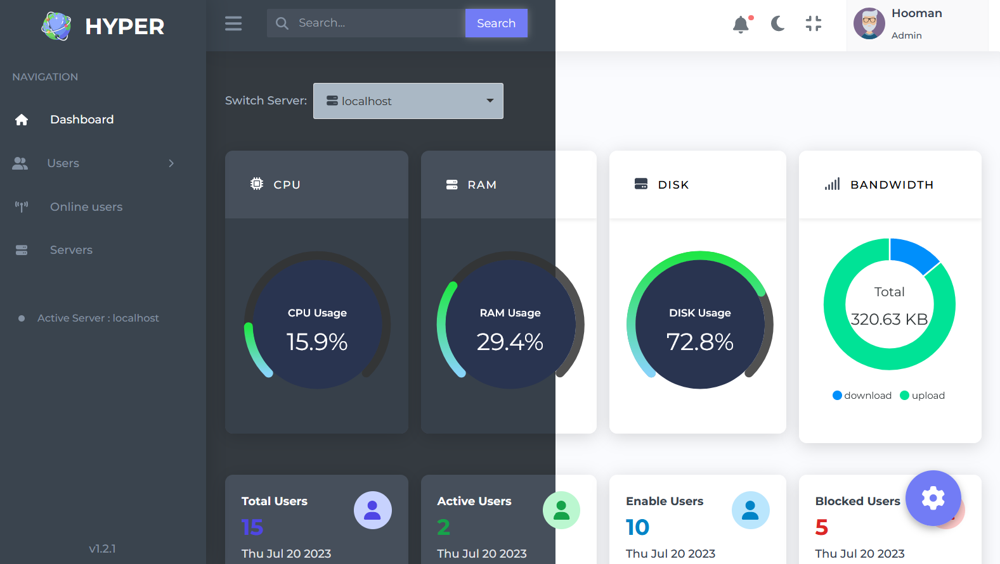
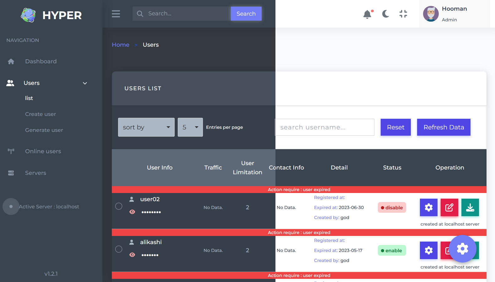
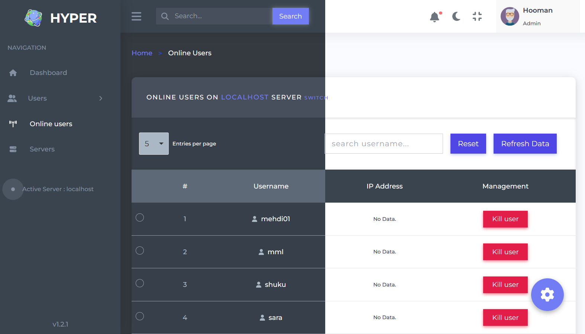
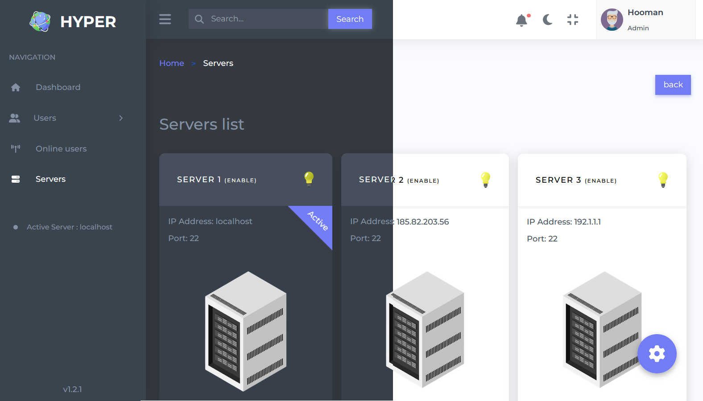
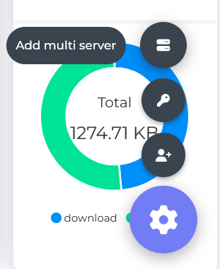
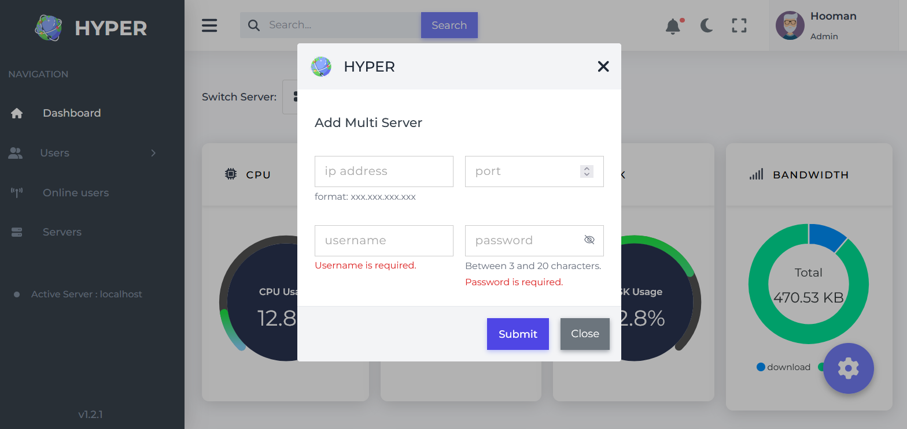

<h1 style="display: flex;align-items: center; gap:1rem"> Hyper Admin Panel </h1>   
<a href='https://github.com/hoomanFsmo77/Hyper-admin-panel/tree/master/frontend' target="_blank"></a>

## Installation ubuntu/debian
```bash
bash <(curl -Ls https://raw.githubusercontent.com/HyperPanelx/Hyper-Installation/master/install.sh)
```

## Update ubuntu/debian
```bash
bash <(curl -Ls https://raw.githubusercontent.com/HyperPanelx/Hyper-Installation/master/update.sh)
```


## Tech

<a href='https://vuejs.org/' target="_blank"></a>   <a href='https://router.vuejs.org/' target="_blank"></a>   <a href='https://tailwindcss.com/' target="_blank"></a>  <a href='https://www.typescriptlang.org/' target="_blank"></a>  <a href='https://github.com/shivamkapasia0' target="_blank"></a> <a href='https://www.python.org/' target="_blank"></a> <a href='https://www.mongodb.com/' target="_blank"></a> <a href='https://www.docker.com/' target="_blank"></a>

## Preview


## Panel contains 4 main pages
### 1- Dashboard
#### in this page as you can see is server and client status are live visible that is programmed by web socket.


### 2- Users

#### this page belongs to users and its operation. You are able to 1- change the password 2- renew expired user 30  3- lock/unlock user 4- download user detail in text file 5- edit user detail 6- generate several user 7- create single user


### 3- Online users
#### in this page is shown the status of online user, which you can disconnect their connection.


### 4- Servers
#### in this page you can see the available servers which you are able to switch between them.


### Settings section
#### by this float button you can configure your panel by opening a modal.


